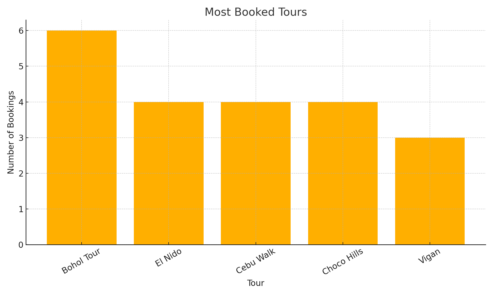
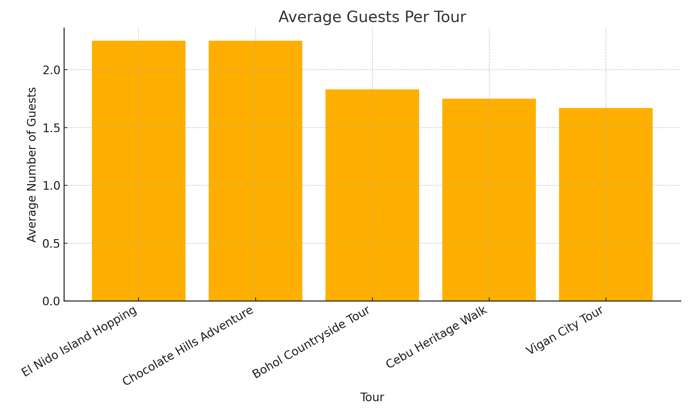

# 🌴 Tourism Analytics System

A data-powered analytics tool for the tourism industry.

## 📊 Features
- Most Booked Tours Report
- Total Revenue Calculation
- Guest Distribution per User

- Visualizations using Python (Matplotlib)

## 🛠 Tech Stack
- MySQL (Data Source)
- Python (Analytics + Charting)
- GitHub CLI (Project Management)

## 📁 Structure
- `sql/`: SQL queries and schema files
- `visuals/`: Screenshots and generated charts
- `docs/`: Documentation, notes, and flowcharts

## 🚀 Goal
To provide real-time, actionable insights for tour operators and local tourism businesses.

## 🔗 Author
**Hermes Colina**  
[GitHub](https://github.com/hermescolina) | [LinkedIn](https://www.linkedin.com/in/hermes-colina)

