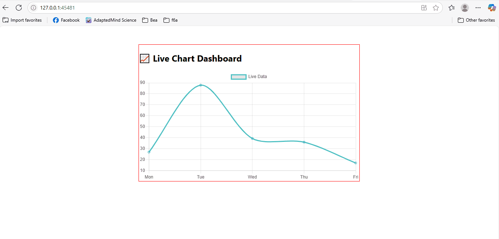

# 🌍 Tourism Analytics Dashboard – TourWise

**TourWise** is an interactive tourism analytics platform built with React and Flask, now with full booking navigation and hosted on GitHub Pages!

🔗 **Live Site:** [https://hermescolina.github.io/tourism-analytics/](https://app.tourwise.shop/tourism-analytics/)

🔗 **Live Site:** [https://hermescolina.github.io/tourism-analytics/](https://app.tourwise.shop/tourism-analytics/)


---

## 🧱 Project Structure

```
tourism-analytics/
├── backend/                # Flask backend (legacy)
├── backend-node/           # Node.js backend (current)
├── docs/                   # Diagrams and supporting documentation
│   └── tourwise-dynamic-pages-setup.md  # Dynamic subpage documentation
├── frontend/               # React + Vite application
│   ├── dist/               # Built static site
│   ├── public/             # Static assets (images, logo, etc.)
│   └── src/                
│       ├── assets/         # Icons, backgrounds, and local images
│       ├── components/     # Reusable React components
│       └── pages/          # Tour pages and landing screens
├── frontend.bak02/         # Backup of earlier frontend iteration
├── k8s/                    # Kubernetes deployment configs
├── docker-compose.yml      # Docker multi-service setup
├── start.sh                # Launcher script for services
├── README.md               # Project overview and instructions
```

---

## 🚀 Getting Started

### 🔧 Local Setup with Minikube

```bash
# Set Docker to Minikube's environment
eval $(minikube docker-env)

# Build backend (Node.js)
cd backend-node
docker build -t node-backend .

# Build frontend (Vite + React)
cd ../frontend
docker build -t react-frontend .

# Deploy both
cd ../k8s
kubectl apply -f .

# Access frontend
minikube service react-frontend --url
```

---

## ✨ Features

* ✅ Fully responsive UI built with React + Vite
* ✅ Live chart visualization using Chart.js
* ✅ Search and filter tours by keyword
* ✅ Clickable destination cards with dynamic routing
* ✅ "Book Now" buttons open a new tab with a full listing
* ✅ Hosted on GitHub Pages
* ✅ Dockerized and Kubernetes-ready
* ✅ Dynamic subpages using reusable templates and query string routing

---

## 📊 API Sample

**GET** `/api/data` returns:

```json
{
  "labels": ["Mon", "Tue", "Wed", "Thu", "Fri"],
  "values": [45, 78, 23, 90, 33]
}
```

---

## 🗺️ Pages Available

* `/` – Landing Page
* `/el-nido` – El Nido Island Hopping
* `/vigan` – Vigan Heritage Walk
* `/chocolatehills` – Chocolate Hills Tour
* `/siargao` – Siargao Surf Camp
* `/tour-cards` – Complete listing of tours
* `/tour?title=Boracay Beach Escape` – Dynamic tour detail page (template-based)

---

## 🔄 Roadmap

* [x] Add tour details and booking links
* [x] Deploy live demo on GitHub Pages
* [x] Move from Flask to Node backend
* [x] Document dynamic page strategy in `/docs`
* [ ] Add form-based booking engine
* [ ] Integrate with payment gateway
* [ ] CI/CD with GitHub Actions

---

## 📊 Project Progress

**Estimated Completion:** `15%`

### ✅ Completed

* Frontend live on GitHub Pages
* Project structure and deployment scripts in place
* Updated documentation
* Implemented dynamic routing for subpages using `TourDetail.jsx`

### 🚧 In Progress

* Backend API development (Flask & Node.js)
* Integration of frontend with API
* CI/CD pipeline setup

### 🛠️ Next Steps

* Implement user authentication
* Add booking features
* Launch analytics dashboard
* Add and connect additional dynamic templates (Vendor, Booking, Analytics)

## 🖥️ Demo Preview



---

## 👨‍💻 Maintainer

**Hermes Colina**

* [GitHub](https://github.com/hermescolina)
* [LinkedIn](https://www.linkedin.com/in/hermescolina)

---

> Star the repo ⭐ and contribute 🚀 to make TourWise even better!

